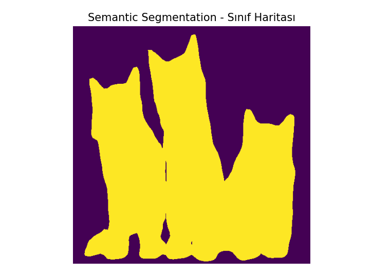
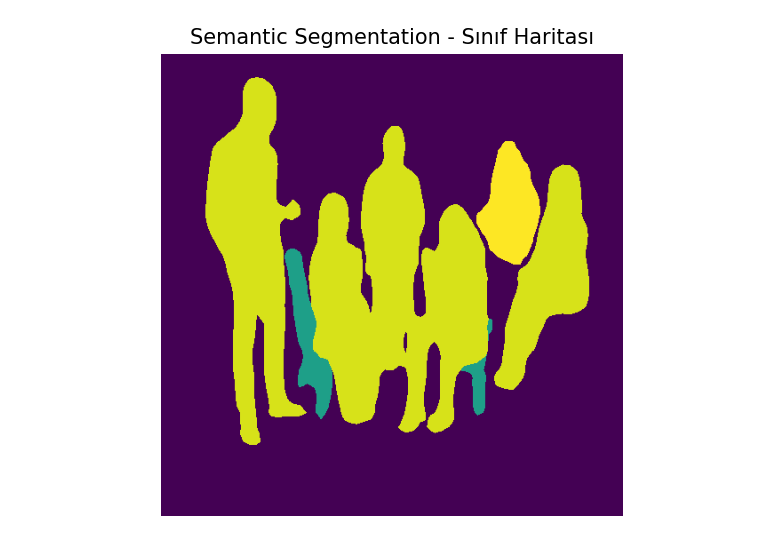
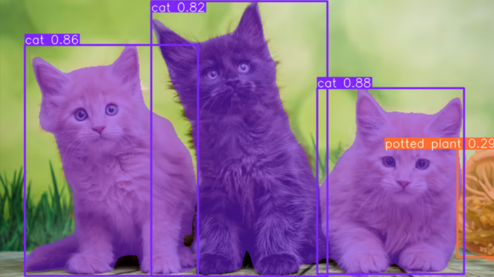
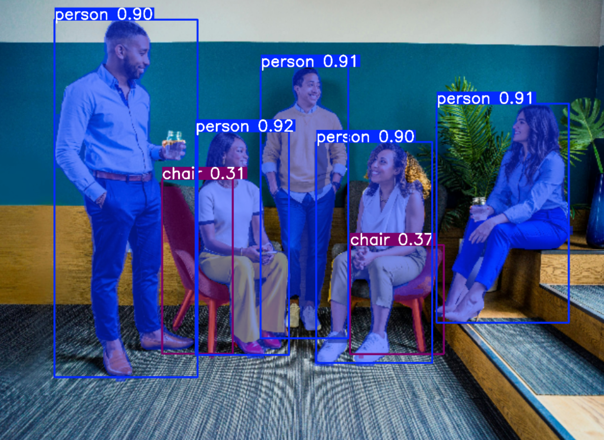
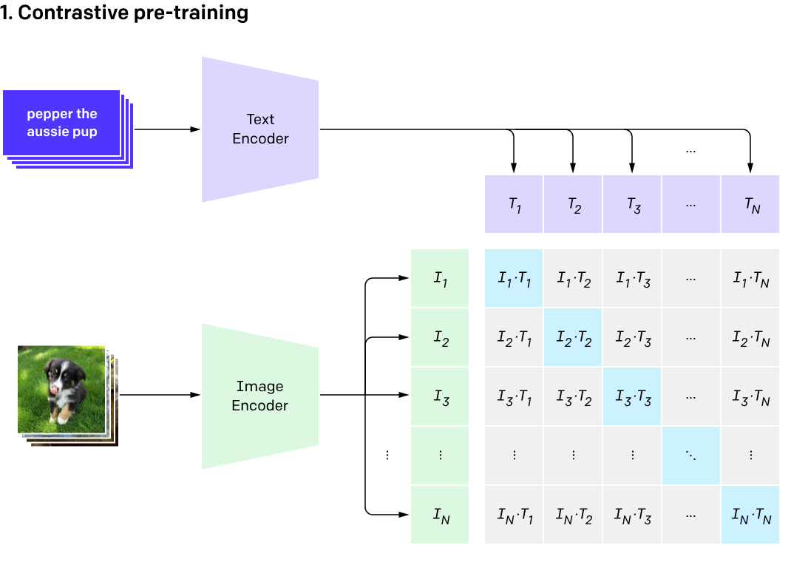

# Görüntü Segmentasyonu: İki Farklı Yöntemin Birleşimi

Bu proje, bilgisayarlı görü alanındaki iki temel segmentasyon tekniğini, **anlamsal (semantic)** ve **örnek (instance)** segmentasyonunu, tek bir Python kodu içinde birleştirir. Amacım, bir görüntüyü hem kategori bazında hem de tekil nesne bazında analiz ederek bu iki yaklaşımın farklarını ve bir araya geldiğinde nasıl güçlü bir çözüm sunduğunu göstermektir.

---

## Segmentasyon Kavramına Giriş

Segmentasyon, bir görüntüyü piksel düzeyinde anlamlı bölgelere ayırma işlemidir. Geleneksel nesne algılamadan (nesneleri sınırlayıcı kutularla işaretlemek) farklı olarak, nesnelerin tam sınırlarını ve şeklini belirler. Segmentasyonun temel olarak iki türü vardır:

### 1. Anlamsal Segmentasyon (Semantic Segmentation)

-   **Tanım:** Görüntüdeki her pikseli ait olduğu **kategoriye** göre sınıflandırır.
-   **Özellik:** Aynı sınıfa ait olan farklı nesneler arasında ayrım yapmaz. Örneğin, bir görseldeki tüm kuşlar aynı "kuş" kategorisinde yer alır.



### 2. Örnek Segmentasyonu (Instance Segmentation)

-   **Tanım:** Anlamsal segmentasyondan farklı olarak, aynı sınıfa ait olan **her bir nesne örneğini (instance)** birbirinden ayırır.
-   **Özellik:** Her bir nesneye hem kategori hem de benzersiz bir kimlik (ID) atar. Bu sayede, görseldeki üç farklı kediyi "kedi_1", "kedi_2", "kedi_3" olarak ayırt edebilir.

<small>Kaynak: <a href="https://animals.howstuffworks.com/pets/most-common-cat-breeds.htm" target="_blank">Shutterstock</a></small>


---

## Proje Yapısı ve Kullanılan Teknolojiler

Proje, bu iki yöntemi birleştiren tek bir `updated.py` dosyası üzerine kuruludur. Dosya yapısı, projeyi kolayca yönetilebilir hale getirmek için tasarlanmıştır.

Projenin temel dizin ve dosya yapısı aşağıdaki gibidir:

    ├── SEGMENTASYON/
    │   ├── img/                       # Örnek ve çıktı görsellerinin bulunduğu klasör
    │   ├── instanceSegmentation.py    # Örnek segmentasyon için ayrı kod
    │   ├── semanticSegmentation.py    # Anlamsal segmentasyon için ayrı kod
    │   ├── tempCodeRunnerFile.py      # Geçici kod dosyası (genellikle IDE tarafından oluşturulur)
    │   ├── updated.py                 # İki segmentasyon yöntemini birleştiren ana proje kodu
    │   └── yolov8n-seg.pt             # YOLOv8 modelinin önceden eğitilmiş ağırlıkları

### `updated.py`

Bu dosya, hem anlamsal hem de örnek segmentasyon modellerini aynı görsel üzerinde çalıştırır ve sonuçları görselleştirir.

-   **Anlamsal Segmentasyon:** `torchvision` kütüphanesindeki önceden eğitilmiş **DeepLabv3** modeli kullanılır.
-   **Örnek Segmentasyonu:** `ultralytics` kütüphanesindeki önceden eğitilmiş **YOLOv8n-seg** modeli kullanılır.

### Model Ağırlıkları ve Diğer Dosyalar

-   `yolov8n-seg.pt`: YOLOv8 modelinin önceden eğitilmiş ağırlık dosyası.
-   `img/`: Proje çıktılarının ve örnek görsellerin saklandığı klasör.
-   `instanceSegmentation.py` ve `semanticSegmentation.py`: Projenin gelişim sürecinde kullanılan, ayrı segmentasyon tipleri için yazılmış kodlar.

---

## OpenCLIP: Görüntü ve Metni Birbirine Bağlayan Evrensel Bir Model

Bu projemizden farklı olarak, bilgisayarlı görü alanında son zamanlarda büyük ilgi gören bir başka teknoloji de **OpenCLIP**'tir. OpenCLIP'in temel amacı, bir görselle en çok eşleşen metni bulmayı öğrenerek görsel ve dil arasında bir köprü kurmaktır.

### Basitçe Nasıl Çalışır?

Geleneksel modellerin aksine, OpenCLIP'in eğitimi belirli etiketlere dayanmaz. Bunun yerine, internetten toplanmış yüz milyonlarca görsel-metin çiftini kullanır.

-   **İkili Yapı:** Model, bir **görsel kodlayıcısı** ve bir **metin kodlayıcısından** oluşur.
-   **Eşleştirme Oyunu:** Eğitim sırasında, model görsel-metin çiftlerinin vektörlerini aynı sanal uzayda birbirine yaklaştırmayı öğrenir. Örneğin, bir köpek fotoğrafıyla "bir köpek çimenlerde koşuyor" metni yakın, ancak "bir kedi masada oturuyor" metni uzak tutulur.
-   **"Sıfır-Çekim" Yeteneği:** Bu sayede, model daha önce hiç görmediği bir görseli, o görselle en çok eşleşen metni bularak etiketleyebilir. Bu, OpenCLIP'i inanılmaz derecede esnek ve yeni görevlere uyum sağlayabilir hale getirir.

(https://arxiv.org/abs/1706.05587)
<small>Kaynak: <a href="https://arxiv.org/abs/1706.05587" target="_blank">DeepLabv3: Rethinking Atrous Convolution for Semantic Image Segmentation</a></small>


---

## Kurulum ve Kullanım

Projenin tüm bağımlılıklarını tek bir komutla yükleyebilirsiniz:

```bash
pip install torch torchvision numpy opencv-python matplotlib ultralytics